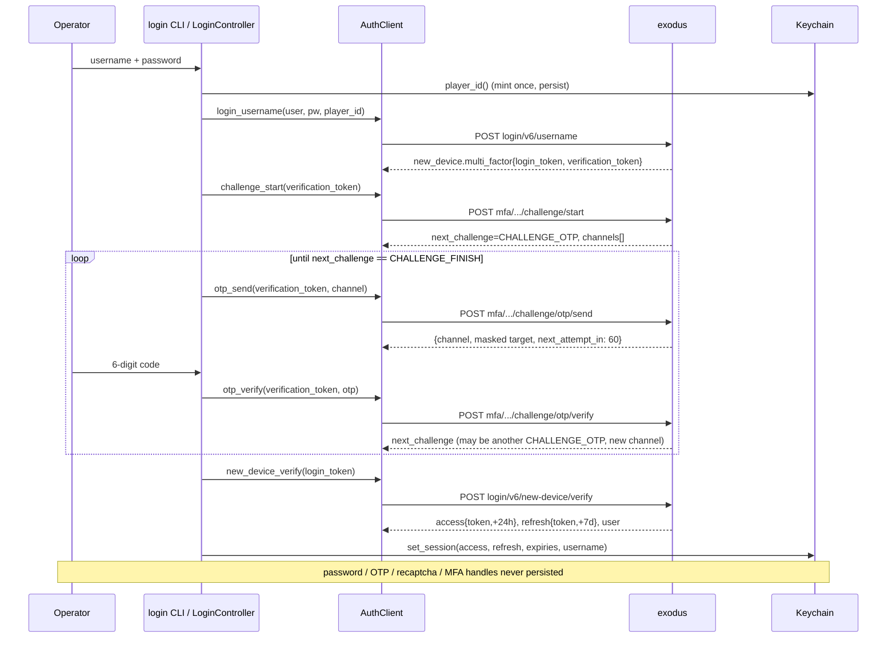

# Data API Layer & Login Flow — CurrentFlow DAL export

**Status:** derived export, not a spec. This document describes the DAL and auth vertical
**as built** (`currentflow/dal/*`, `currentflow/ui/login_view.py`, the auth block of
`currentflow/config.py`). Authority stays upstream:

| Question | Authority |
|---|---|
| What the wire looks like | [`DATA_SOURCES.md`](../DATA_SOURCES.md) §1, §4, §4.1, §4.2, §6 |
| What the system must do | [`LOCKED_SPEC.md`](../LOCKED_SPEC.md) (§9.1 auth, §10 stack, §15 disclaimers) |
| Conventions this code obeys | [`CLAUDE.md`](../CLAUDE.md) (DAL rules, missing ≠ zero, no silent caps) |
| What the login UI looks like | [`design/SCREENS_login.md`](../design/SCREENS_login.md) (States A/B/C) |

If this document and any of the above disagree, the above wins — and this file is stale.

**Posture (§10 / §15).** Single operator, local-first. Every call is made from the
operator's **own authenticated Stockbit session**, at own risk. Nothing is republished,
no SaaS, no multi-user, no redistribution. Endpoint/parser breakage is routine
maintenance, not an incident.

**What this layer does *not* do.** The DAL is auth + fetch + stamp + type. It holds no
signal logic and no presentation state, so **RULE A** (phase gate) and **RULE B**
(presentation gate) are untouched by anything in here. Its one contribution to those
rules is the `as_of` stamp that makes look-ahead safety checkable downstream.

---

## 1. Layer map

```
                        ./run.sh login | paste | check | clear
                                        │
        ┌───────────────────────────────┴───────────────────────────────┐
        │  dal/login.py            — operator CLI (argparse, getpass)   │
        │  ui/login_view.py        — pure state machine for the UI      │
        └───────────────┬───────────────────────────┬───────────────────┘
                        │ credentials + OTP         │ pasted Bearer
                        ▼                           ▼
        ┌─────────────────────────┐   ┌──────────────────────────────┐
        │ dal/auth.py             │   │ dal/session.py               │
        │  AuthClient — 5-step    │   │  build_live_client()         │
        │  login/MFA, no Bearer   │   │  verify_bearer()             │
        │  (POST, browser headers)│   │  build_session_refresh()     │
        └───────────┬─────────────┘   │  store_auth_session()        │
                    │ Session         │  session_status()            │
                    ▼                 └──────────┬───────────────────┘
        ┌───────────────────────────────┐        │
        │ dal/token_store.py            │◀───────┘  reads access_token()
        │  macOS Keychain, 3 accounts:  │
        │   bearer · session · player_id│
        └───────────┬───────────────────┘
                    │ token, fresh per request
                    ▼
        ┌───────────────────────────────┐
        │ dal/transport.py HttpxTransport│  GET/POST + Bearer + BROWSER_HEADERS
        └───────────┬───────────────────┘
                    ▼
        ┌───────────────────────────────┐      ┌──────────────────────┐
        │ dal/client.py  ExodusClient   │─────▶│ dal/errors.py        │
        │  one method per feed          │      │  Auth/Paywall/       │
        │  status mapping + backoff     │      │  RateLimit/Transport │
        └───────────┬───────────────────┘      └──────────────────────┘
                    │ raw JSON            ┌──────────────────────┐
                    ▼                     │ dal/netlog.py        │
        ┌───────────────────────────────┐ │  one redacted        │
        │ dal/parse.py  → dal/models.py │ │  `net-error` line    │
        │  typed records, every one     │ └──────────────────────┘
        │  carrying `as_of`             │        ▲ every seam logs here
        └───────────┬───────────────────┘
                    │ dal/timing.py supplies the `as_of` stamp
                    ▼
             store/ (DuckDB, keyed (symbol, date, as_of)) via ingest/
```

| Module | Lines | Responsibility |
|---|---|---|
| `dal/__init__.py` | 32 | Public surface: `ExodusClient`, the error taxonomy, `BrokerNet` / `DailyBar` / `RowStatus` / `Side`. |
| `dal/errors.py` | 30 | Four-class taxonomy; the retry policy is encoded in the class, not at call sites. |
| `dal/timing.py` | 37 | `as_of` (availability_ts) derivation — the look-ahead firewall. |
| `dal/transport.py` | 95 | httpx GET/POST; injects Bearer + browser headers; maps network faults to `TransportError`. |
| `dal/client.py` | 308 | One method per feed; status→error mapping, backoff, one-shot 401 refresh, pagination. |
| `dal/parse.py` | 426 | Payload → typed records. Tolerant coercers; absence stays `None`. |
| `dal/models.py` | 254 | Frozen slotted dataclasses; every record carries `as_of`. |
| `dal/auth.py` | 320 | `AuthClient`: the 5-step credential + MFA login. Carries no Bearer. |
| `dal/token_store.py` | 186 | Keychain store: pasted Bearer, login session blob, device `player_id`. |
| `dal/session.py` | 169 | The one production construction site: wire store + transport into a client. |
| `dal/login.py` | 171 | Operator CLI (`login`/`paste`/`status`/`check`/`clear`). |
| `dal/netlog.py` | 66 | The single redaction point for all network-error logging. |
| `ui/login_view.py` | 243 | Streamlit-free login state machine (`CREDENTIALS → OTP → FINISH`, `BEARER` fallback). |

Base URL for everything below: `https://exodus.stockbit.com` (`config.EXODUS_BASE_URL`).

---

## 2. Login flow

### 2.1 Verified wire contract

Five `POST … application/json` calls, pinned from two independent own-session HAR
captures (`login-stockbit.har` 2026-07-03; `stockbit.com.har` 2026-08-08 — contract
reproduced unchanged). Field **shapes** only; no secret is ever reproduced in the repo.

| # | Path (`config.AUTH_*_PATH`) | Request | Response |
|---|---|---|---|
| 1 | `login/v6/username` | `{user, password, recaptcha_token, recaptcha_version: "RECAPTCHA_VERSION_3", player_id}` | **new device:** `data.new_device.multi_factor.{login_token, verification_token}` (36 chars each) · **trusted device:** `data.login.{user, token_data.{access.{token,expired_at}, refresh.{token,expired_at}}}` — a session, no MFA |
| 2 | `mfa/verification/v1/challenge/start` | `{verification_token}` | `data.next_challenge`, `data.supporting_data.otp.{channels:[{channel,target}], default_channel}` |
| 3 | `mfa/verification/v1/challenge/otp/send` | `{verification_token, channel}` | `data.{channel, target (masked), next_attempt_in: 60}` |
| 4 | `mfa/verification/v1/challenge/otp/verify` | `{verification_token, otp}` (6 digits) | `data.next_challenge` — **may be another `CHALLENGE_OTP` on a new channel** |
| 5 | `login/v6/new-device/verify` | `{multi_factor: {login_token}}` | `data.access.{token,expired_at}`, `data.refresh.{token,expired_at}`, `data.user.{id,username,…}`, `data.onesignal_hash` |

Channels observed: `CHANNEL_EMAIL`, `CHANNEL_WHATSAPP`, `CHANNEL_SMS`. Targets arrive
pre-masked by the server (`tom****@gmail.com`).

**Step 4 is a loop, and the loop is the norm.** Both captures needed **two rounds across
different channels** (email → WhatsApp) before `CHALLENGE_FINISH`. A driver that assumes a
single round is wrong for this account. Implementation: the caller repeats send→verify
while `not Challenge.is_finished` — `dal/login.py:68` (CLI) and
`ui/login_view.py:176-179` (UI, which auto-sends the next round's code).

**Step 5 runs only after `CHALLENGE_FINISH`**, and uses the `login_token` from step 1 —
not the `verification_token` that drove the MFA loop.

**Token lifetimes are exact, not approximate** (re-measured 2026-08-08): issued
`08:04:29Z` → access `expired_at` **+24 h to the second**, refresh **+7 d to the second**,
ISO-8601.

### 2.2 Two branches, selected by `player_id`

`player_id` is a OneSignal-style device UUID and the server's **device-trust anchor**. It
is **required** — empty or absent is rejected `400 "Permintaan tidak valid"`.

- A **previously verified** `player_id` → step 1 returns a session directly. No OTP.
- A **fresh** `player_id` → step 1 returns MFA handles; the OTP loop runs once for that
  device.

Implementation (`token_store.py:163`): `player_id()` mints a UUIDv4 on first read and
persists it in the Keychain forever. It **survives `clear()`** — sign-out ends the session
but keeps the device trusted, so the next login is direct. `clear_player_id()` deliberately
forgets it to force a fresh MFA.

The two response shapes nest differently (`data.login.token_data.*` for the trusted-device
branch vs flat `data.*` for step 5); `auth._session_from_data` (`auth.py:109`) normalizes
both into one `Session`.

> Caveat carried from `DATA_SOURCES.md §4.1`: the 2026-08-08 capture's `player_id` is the
> *browser's*, so it is no evidence about whether the repo's persisted id earns the
> trusted-device branch. That claim rests only on the 2026-07-03 live probe.

### 2.3 reCAPTCHA — presence-only

Live-probed 2026-07-03 against the own account: a **reused stale** token → 200; an
**arbitrary junk string** → 200; **empty/absent** → `400 "Permintaan tidak valid"`. The
server checks presence, not content or freshness. There is no Google `siteverify` behind
this route to satisfy, so **no browser, DevTools snippet, bookmarklet, or headless engine
is needed** — the client sends the fixed placeholder
`config.AUTH_RECAPTCHA_PLACEHOLDER = "currentflow"` and still sends
`recaptcha_version = "RECAPTCHA_VERSION_3"`. The public v3 site key is retained in config
for reference only and mints nothing; the console-snippet module `dal/recaptcha.py` was
removed.

### 2.4 The edge filter (2026-08-08) — `BROWSER_HEADERS`

From 2026-08-08 `login/v6/username` began returning a **bodyless 403** to the CLI (18
occurrences in `logs/net.log`, 14:53–15:14) while the same account signed in from Chrome
15 seconds after the last failure. Diagnosis: application rejections always carry a
`message` (both documented 400s do), so an empty 403 means the request never reached the
app — an edge/bot filter. The CLI's request was trivially bot-shaped: `python-httpx/0.28.1`,
no `Origin`, no `Referer`, `Accept: */*`, HTTP/1.1.

Mitigation: `config.BROWSER_HEADERS` — UA, `Accept`, `Accept-Language`, `Origin`,
`Referer`, `sec-ch-ua*`, `Sec-Fetch-*` lifted **verbatim** from the operator's own browser
capture, so they stay evidence-pinned like every other constant. Applied by **both** seams:
`AuthClient._post` (`auth.py:160`) and `HttpxTransport._auth_headers` (`transport.py:54`).
`Authorization` is spread **last** so the block can never shadow it; it is absent from the
constant itself because it is per-request. Pinned by `tests/test_browser_headers.py`.

> **Not proven to work.** This addresses a *header*-level filter only. If the edge
> fingerprints TLS/HTTP2 (JA3/JA4), the 403 persists and the standing fallback is
> `./run.sh paste` with a Bearer lifted from a browser session.

### 2.5 Two documented 400s on step 1

A 400 on step 1 is *at least* two different failures:

| Reason | `message` |
|---|---|
| Malformed request (empty `recaptcha_token` or empty `player_id`) | `"Permintaan tidak valid"` |
| Bad credentials | `"Username atau password salah. Mohon coba lagi."` (`error_type: "INVALID_PARAMETER"`) |

`error_type` is observed but **deliberately not wired**: only one sample exists and the
malformed-request 400's `error_type` is unknown, so it may not discriminate. The
`netlog` `server_message` carve-out (§4.5) already separates these from logs alone.

### 2.6 Sequence — new device



Trusted device collapses this to step 1 → `set_session` (`login.py:60`,
`login_view.py:95`).

### 2.7 UI state machine (`ui/login_view.py`)

Deliberately Streamlit-free so it is unit-testable; `ui/app.py` drives it and renders
`LoginView`.

```
CREDENTIALS ──submit_credentials──▶ OTP        (or ──▶ FINISH on trusted device)
OTP         ──verify_otp──────────▶ OTP        (server asked for another factor)
OTP         ──verify_otp──────────▶ FINISH     (CHALLENGE_FINISH → new_device_verify)
CREDENTIALS ──(State C link)──────▶ BEARER
BEARER      ──submit_bearer───────▶ FINISH     (only after a live ping succeeds)
any state   ──AuthError───────────▶ same state, `error` set, stored session UNTOUCHED
any state   ──sign_out────────────▶ CREDENTIALS (store cleared, player_id kept)
```

Maps to the design's States A (credentials) / B (OTP) / C (Bearer paste) in
`design/SCREENS_login.md`.

Two behaviours worth naming:

- **The code is sent on entering each OTP round**, not by an operator button.
  `_enter_otp` (`login_view.py:109`) honours the server's `default_channel` — the server
  dictates which factor is due — and reports the new `otp_target` so the UI renders a
  fresh, empty field for the second round. `send_otp` remains for an explicit resend
  against the `next_attempt_in` cooldown.
- **A wrong code keeps its context.** `_otp_error_view` (`login_view.py:190`) preserves the
  current channel/target so the UI keeps showing "code sent to …" and the field key stays
  stable across the retry, instead of dropping back to a blank challenge.

`LoginView` carries **no secret** — step, masked channels/targets, cooldown, optional
error, and (once signed in) the username. `initial_view()` renders `FINISH` from a stored
session with **no network call**.

### 2.8 Bearer-paste fallback (State C)

`submit_bearer` (`login_view.py:211`) strips an optional `Bearer ` prefix, then
**verifies before it writes**: `session.verify_bearer` (`session.py:66`) makes one short
live request (7 days of `BBCA` bars) with the candidate token and stores it only on
success. A rejected or unreachable token is never stored — no store-then-discover.

### 2.9 Secret handling rules

| Datum | Lifetime |
|---|---|
| Password, OTP, recaptcha token | Transient in memory for one call. Never persisted, never rendered back, never logged. |
| `login_token`, `verification_token` | Transient for one login attempt; dropped on FINISH (`login_view.py:186`). |
| Access + refresh tokens, expiries, username | Keychain, one JSON blob under `KEYCHAIN_SESSION_ACCOUNT`. |
| Pasted Bearer | Keychain, `KEYCHAIN_ACCOUNT`. |
| Device `player_id` | Keychain, `KEYCHAIN_PLAYER_ID_ACCOUNT`. Not a secret; kept so it survives sign-out. |

Nothing above ever reaches a repo file or plaintext disk. `AuthClient` never logs a
request body (`auth.py:154-156`); `netlog` structurally cannot receive one (§4.5). Pinned
by `test_secrets_never_appear_in_logs`.

`session_status()` (`session.py:139`) is the only read-back, and it is non-network and
masked: `has_token`, `source` (`"login"` / `"paste"`), `username`, `access_expires`, a
`abcd…wxyz` preview, and the length.

### 2.10 Keychain store

macOS generic-password items via the `security` CLI over `subprocess` — zero new
dependency, and the runner is injected so the store is fully testable without touching a
real Keychain (`token_store.py:35`). One service (`currentflow-exodus`), three accounts:

| Account | Contents |
|---|---|
| `bearer` | Raw pasted Bearer (slice-10 fallback). |
| `session` | `SessionData` JSON: access, refresh, both expiries, username. |
| `player_id` | The device UUID. |

`access_token()` is what the transport reads: **the login session's access token if
present, else the pasted Bearer** — so the transport is agnostic to which path
established the session. A read failure or a corrupt blob returns `None`, never `""`:
missing ≠ empty, and a caller that needs a token must fail loud rather than send a blank
`Authorization` header. `set()` / `set_session()` refuse an empty token outright.
Writes use `security add-generic-password -U`, so re-capture is idempotent.

### 2.11 Operator CLI

```
./run.sh login    →  python -m currentflow.dal.login login    # credentials + OTP → session
./run.sh paste    →  …                              paste     # fallback: Bearer → Keychain
./run.sh check    →  …                              check     # live ping (BBCA, 7d)
                     …                              status    # masked, no network
                     …                              clear     # drop session; keep player_id
```

Exit codes: `0` ok · `1` auth failure / nothing stored · `2` transport error. `login` and
`paste` read secrets through `getpass` (never echoed, never in shell history).
`configure_logging()` runs first so any `net-error` line lands in `logs/net.log`.

`./run.sh` itself always starts the terminal — the app renders the login gate when there
is no session, rather than refusing to boot. Commands that need the network
(`ingest`, `backfill`, `schedule`) hard-fail early with `no session — run './run.sh login'`.
The headless `schedule` daemon **cannot** do an OTP re-login, so a mid-run 401 fails loud
by design.

---

## 3. Session wiring

`dal/session.py` is the single production construction site; everywhere else the client is
transport-injected for tests.

```python
client, transport = build_live_client()        # store → transport → ExodusClient
try:
    bars = await client.ohlcv_foreign("BBCA", frm, to)
finally:
    await transport.aclose()                   # release the httpx pool
```

`build_live_client` (`session.py:21`) accepts one of two 401-refresh seams:

| Seam | Behaviour |
|---|---|
| `refresher=` | `build_session_refresh(store)` — swaps the stored refresh token for a fresh session via `AuthClient.refresh`. Takes precedence. |
| `prompt=` | Re-capture a pasted Bearer interactively (slice-10 path). |
| neither | A 401 fails loud immediately. |

The transport reads the token **fresh per request** from `token_provider`, so a refresh or
re-paste takes effect on the next call without rebuilding the client.

**Refresh does not currently work, on purpose.** `config.AUTH_REFRESH_PATH` is `None`
because the refresh route and shape were never exercised in either capture — access was
valid throughout both. `AuthClient.refresh` (`auth.py:274`) raises `AuthError` rather than
guess an endpoint, and `build_session_refresh` therefore always raises, sending the UI back
to State A. That is the intended failure: re-login, never stale/empty. Pinned by
`test_refresh_fails_loud_until_route_confirmed`. To close it: capture a real refresh
exchange (or let an access token expire), pin `AUTH_REFRESH_PATH`, then implement.

---

## 4. Data API layer

### 4.1 Contract between transport and client

The seam is deliberately narrow (`transport.py:1-16`):

- The transport returns the **raw `Response`**; the **client** maps status codes. A
  transport must never swallow an HTTP status.
- A network-level failure (connect / read / timeout) raises `TransportError` so the
  client's backoff engages.
- A missing token raises `AuthError` **before the request is sent** — "never emit
  stale/empty" extends to never sending no-auth.

`Transport` and `PostTransport` are plain callables `(path, params|body) -> Awaitable[Response]`,
so tests inject `httpx.MockTransport` and prod injects `HttpxTransport`.

### 4.2 Error taxonomy and retry matrix

| Status / fault | Error | Retried? | Rationale |
|---|---|---|---|
| `200` | — | — | Return `resp.json()`. |
| `401` | `AuthError` | **Never.** One refresh attempt if a seam is wired, then fail loud. | Token expired/invalid. Emitting stale or empty data here is the failure mode the rule exists to prevent. |
| `402`, `403` | `PaywallError` | Yes, backoff | Paywall counter / Pro gate. Retryable, but ultimately an operational limit — throttle and ingest-once instead of leaning on it. |
| `429` | `RateLimitError` | Yes, backoff | — |
| `5xx` | `TransportError` | Yes, backoff | — |
| network fault | `TransportError` | Yes, backoff | Raised by the transport. |
| anything else | `TransportError` | No | Unexpected status → fail loud, don't guess. |

Backoff: `BACKOFF_BASE_SECONDS × 2^attempt` = **2, 4, 8, 16 s**, `MAX_RETRIES = 4`, then
the class-appropriate error is raised with an `exhausted 4 retries` message. `sleep` is
injected so tests don't wait. Core: `_request` (`client.py:228`) and `_maybe_backoff`
(`client.py:277`).

The 401 path is a **one-shot** refresh: the `refreshed` flag (`client.py:232`) guarantees a
single attempt, so an expired refresh token cannot spin. Refresh is awaited only when it
returns a coroutine (`client.py:304`), so sync and async seams both work.

### 4.3 Feed methods

One method per feed (`CLAUDE.md` DAL rule). Every method returns typed records carrying
`as_of`.

| Method | Endpoint | Returns | Notes |
|---|---|---|---|
| `broker_summary(sym, day)` | `marketdetectors/{sym}` | `list[BrokerNet]` | **One day only** (`from = to = day`). Live-verified: a multi-day range returns a single range **aggregate** with every row stamped `netbs_date = from`, so per-day rows exist only day-by-day and callers loop. Fixed params: `TRANSACTION_TYPE_NET`, `MARKET_BOARD_REGULER`, `INVESTOR_TYPE_ALL`. History to 2019. **Paywall-counted per call.** |
| `ohlcv_foreign(sym, from, to)` | `company-price-feed/historical/summary/{sym}` | `list[DailyBar]` | OHLCV + foreign + VWAP. Pages internally (§4.4). |
| `symbol_info(sym)` | `emitten/{sym}/info` | `SymbolInfo` | Universe-gate flags + index membership (Track A/B). **Live snapshot** — `as_of` = fetch time, not historically replayable. |
| `corp_actions(sym)` | `corpaction/{sym}` | `list[CorpAction]` | Drives the ±5-day exclusion window. |
| `special_board()` | `emitten/indexes/special-board` | `dict[str, BoardType]` | Dev-board membership → ARA/ARB band selection. |
| `ksei_ownership(sym, …)` | `emitten-metadata/shareholders/{sym}/chart` | `list[OwnershipSlice]` | Monthly Local vs Foreign %. KSEI's publish lag is undisclosed, so `as_of` = fetch time — the only availability we can honestly claim. |
| `run_screener(template)` | **POST** `screener/templates` | `list[{symbol, values}]` | Server-side pre-filter (`screeners.md`). Pages by `totalrows` (§4.4). |

Declared in `DATA_SOURCES.md §6` but **not implemented** — each raises by design until its
slice lands: `fundamentals_live`, `fundamentals_hist`, `float_shares`, `orderbook`,
`regime`. `signals/regime.py` reads stored bars, not a live feed.

### 4.4 Pagination — no silent caps

Two feeds enforce pagination, both live-verified; both are walked to exhaustion because a
truncated backfill that *looks* complete is the expensive kind of wrong.

**`ohlcv_foreign`** — without `limit`/`page` the server returns only ~12 most-recent rows
**regardless of the requested range**, and `limit > 50` is a 400. The client pages at
`OHLCV_PAGE_LIMIT = 50`, newest-first, until a short page.

The termination test is the subtle part (`client.py:136-138`): it checks the **raw page
row count** (`ohlcv_page_rowcount`), not the parsed record count. Terminating on the parsed
count would let one malformed row shrink the yield below the limit and end a long backfill
early — silent truncation dressed as a complete pull.

**`run_screener`** — an integer `page` is **required** (omitting it → `400 "Screener Page
can't be empty"`); `limit` is the page size (`SCREENER_PAGE_LIMIT = 900`, about one
IHSG-sized page). The loop stops on three conditions:

1. `len(rows) >= totalrows` — the normal, server-bounded end.
2. An empty page. If the server also claimed a `totalrows` it can't deliver, the shortfall
   is `log.warning`-ed as **incomplete** rather than passed off as the full universe.
3. No `totalrows` at all and a short page — the natural end. Without this the loop would
   cap at page 1 and silently truncate a multi-page universe.

### 4.5 Network-error logging and redaction

`dal/netlog.py` is the **single** formatter for all three seams (`HttpxTransport`,
`AuthClient._post`, `ExodusClient._request`), so redaction is guaranteed in exactly one
place. One greppable line per error:

```
net-error GET marketdetectors/BBCA status=429 outcome=retry 1/4 in 2s
net-error POST login/v6/username status=400 msg="Username atau password salah…" outcome=fail-loud
```

A line carries **method + path + (`status=NNN` | `err=<ExceptionClassName>`) + outcome**
and nothing else. Callers pass the exception **class name**, never the exception or its
`repr` — a `repr` can echo a URL with query params. Level policy: `WARNING` for retryable
(blips, 5xx, 429, an in-progress retry), `ERROR` for terminal (401 after refresh,
unexpected status, retries exhausted).

**One carve-out: `server_message`.** On a fail-loud auth **4xx**, the server's own
rejection reason is the single datum that distinguishes recaptcha enforcement from bad
credentials from a missing `player_id` — so a 400 is diagnosable from `logs/net.log`
without re-running the login. It is a *response* reason, not an exception message and not a
request body: `auth._msg` reads only the response's `message`/`error` field, so a password,
OTP, recaptcha, or token cannot reach it. It is still sanitized here (the single redaction
point): whitespace collapsed and capped at 200 chars so the one-line invariant holds.
**No other caller may pass it.**

`logs/net.log` is a git-ignored rotating file (5 MB × 3 backups) on the operator's machine.
Tail it with `./run.sh log [-f]`.

### 4.6 `as_of` — the look-ahead firewall

`dal/timing.py` is the single place that decides *when* a datum became knowable. Signals
must never consume a record whose `as_of >= decision_ts`; getting this stamp right is what
makes that guarantee real rather than aspirational.

| Feed | `as_of` | Source |
|---|---|---|
| OHLCV bar for day D | `D 16:15` WIB (`OHLCV_AVAILABLE_TIME`) | Post-close publication. |
| Broker summary for day D | 1. the feed's own `data_last_updated`, when present · 2. else `close + BROKER_PUBLISH_LATENCY`, once measured · 3. else **`D+1 09:00`** WIB | Conservative fallback (LD-5). |
| `symbol_info`, `corp_actions`, `ksei_ownership` | fetch time | Live snapshots; not historically replayable. |

`BROKER_PUBLISH_LATENCY` is `None` and stays `None` until an operator measures it
(`ingest/publish_latency.py` exists for exactly this). Until then broker summary for day D
is treated as available the **morning after**, never same-day — so same-day broker signals
are untrusted by construction rather than by discipline. This remains open: neither HAR can
settle it (the 2026-08-08 capture is a weekend login trace with no `marketdetectors` call).

All timestamps in CurrentFlow are **Asia/Jakarta (WIB) local, tz-naive**. IDX has one
exchange timezone; zones are never mixed, so `as_of` and `decision_ts` compare directly.

Two `as_of` traps recorded from the 2026-08-08 capture, for whoever wires the regime gate:
`charts/{sym}/daily?timeframe=today` silently serves the **last trading session** on a
non-trading day with no staleness flag beyond the embedded date — so stamp `as_of` from the
payload's own date, never from wall-clock `now`. And in the same payload `prices[0].date`
is `0` while the real timestamp lives only in `formatted_date`; a parser keying on `date`
gets the epoch.

### 4.7 Typed records — missing is never zero

All records are frozen slotted dataclasses in `dal/models.py`, each carrying `as_of`.

A field absent from the feed is `None`, **never coerced to 0**. A genuine zero — an
illiquid no-trade day — is `0` with `status == NO_TRADES`. `RowStatus` makes the four cases
distinguishable so downstream code cannot read a gap as flat flow:

| `RowStatus` | Meaning |
|---|---|
| `TRADED` | Row present, real activity. |
| `NO_TRADES` | Row present, all-zero (illiquid — observed on XBIG). |
| `NOT_PUBLISHED` | Date not yet available (`as_of > now`). |
| `GAP` | Expected trading day, no row, not a calendar holiday. |

Core records: `DailyBar` (OHLCV + `vwap` from the feed's `average` + `foreign_buy/sell/net`),
`BrokerNet` (per broker per side, with `avg_price` = `netbs_buy_avg_price`, the accumulator
VWAP), `SymbolInfo`, `CorpAction`, `OwnershipSlice`, `SymbolIndexRow`, and the `Scr*Row`
screener rows.

Two conventions in `parse.py` worth knowing:

- **Sign convention (`parse.py:169-171`).** The `marketdetectors` NET feed delivers a net
  seller's `sval`/`slot` **signed negative**. The parser stores a **magnitude** with `side`
  carrying direction, so the aggregation layer's `buy - sell` nets correctly instead of
  double-flipping the sign.
- **Track A/B from absent data.** `SymbolInfo` is a live fetch, not stored, so
  `SymbolIndexRow` is the persisted roster keyed `(symbol, as_of)` that offline views read.
  A missing row is **not** "not a member": the resolver defaults such names to Track B and
  never invents Track A membership from absent data.

### 4.8 Downstream boundary

The DAL hands typed records to `ingest/` → `store/` (DuckDB, keyed
`(symbol, date, as_of)`).

- **Ingest-once.** Only trading days not already stored are fetched; a stored
  `(symbol, date, as_of)` is never re-pulled. This is the primary defence against the
  paywall counter — a dense backtest is tens of thousands of `marketdetectors` calls.
- **No silent caps, again.** `IngestResult` reports `days_skipped_cached` and coverage
  gaps; they are logged, never swallowed.
- **Broker conservation check.** Every buy has a matching sell, so per symbol the gross buy
  value must equal the gross sell value. A fractional imbalance above
  `BROKER_CLEARING_TOL = 0.01` means the feed is truncated (top-N only), rows were dropped,
  or a sign convention broke — surfaced loudly per fetched day.

**Cost floor.** Measured 2026-08-08: median exodus round-trip **131 ms**; heavy data
endpoints cluster **380–433 ms**. No `marketdetectors` sample exists in that capture, so
the latency that actually governs a backfill is still unmeasured — treat 380–433 ms as the
closest proxy. Implied serial network floors, before the 1 s inter-name pause and any
paywall backoff: a dense 200-name × 512-day pull ≈ **11.4 h**; a stride-10 pull ≈ **1.5 h**.
A floor, not a forecast.

---

## 5. Config surface

Every constant below lives in `currentflow/config.py`. None is a tuning knob: each is
pinned from evidence, and the ones that aren't are explicitly `None` rather than guessed.

| Constant | Value | Note |
|---|---|---|
| `EXODUS_BASE_URL` | `https://exodus.stockbit.com` | |
| `HTTP_TIMEOUT_SECONDS` | `30.0` | |
| `MAX_RETRIES` / `BACKOFF_BASE_SECONDS` | `4` / `2.0` | 2, 4, 8, 16 s. |
| `OHLCV_PAGE_LIMIT` | `50` | Server 400s above this. |
| `SCREENER_PAGE_LIMIT` | `900` | ~one IHSG page; `page` is mandatory. |
| `OHLCV_AVAILABLE_TIME` | `16:15` | Post-close bar availability. |
| `BROKER_PUBLISH_LATENCY` | `None` | **Unmeasured — stays `None`.** |
| `BROKER_CONSERVATIVE_AVAILABLE_TIME` | `09:00` | D+1 fallback stamp (LD-5). |
| `BROKER_CLEARING_TOL` | `0.01` | 1% of the larger side. |
| `KEYCHAIN_SERVICE` | `currentflow-exodus` | |
| `KEYCHAIN_ACCOUNT` / `_SESSION_ACCOUNT` / `_PLAYER_ID_ACCOUNT` | `bearer` / `session` / `player_id` | |
| `AUTH_LOGIN_USERNAME_PATH` | `login/v6/username` | |
| `AUTH_CHALLENGE_START_PATH` | `mfa/verification/v1/challenge/start` | |
| `AUTH_CHALLENGE_OTP_SEND_PATH` | `mfa/verification/v1/challenge/otp/send` | |
| `AUTH_CHALLENGE_OTP_VERIFY_PATH` | `mfa/verification/v1/challenge/otp/verify` | |
| `AUTH_NEW_DEVICE_VERIFY_PATH` | `login/v6/new-device/verify` | |
| `AUTH_REFRESH_PATH` | `None` | **Unconfirmed — `refresh()` raises.** |
| `AUTH_RECAPTCHA_VERSION` | `RECAPTCHA_VERSION_3` | |
| `AUTH_RECAPTCHA_PLACEHOLDER` | `currentflow` | Any non-empty string clears the presence check. |
| `AUTH_RECAPTCHA_SITE_KEY` | public v3 key | Reference only; mints nothing. |
| `CHALLENGE_OTP` / `CHALLENGE_FINISH` | as named | Loop sentinel. |
| `BROWSER_HEADERS` | 11 headers | Verbatim from the operator's own capture. `Authorization` deliberately absent. |
| `LOG_FILE` | `logs/net.log` | 5 MB × 3 rotations, git-ignored. |

---

## 6. Invariants and where they're pinned

| Invariant | Enforced at | Test |
|---|---|---|
| One method per feed | `dal/client.py` | — |
| Every record carries `availability_ts` | `dal/models.py`, `dal/timing.py` | `test_parse*.py` |
| DAL enforces `availability_ts < decision_ts` | `dal/timing.py` + consumers | look-ahead test (§13) |
| **401 fails loud, never retried, never stale/empty** | `client.py:249-257`, `errors.py:15` | `test_401_then_refresh_fails_loud` |
| Never send a blank `Authorization` | `transport.py:57-62` | `test_dal_transport.py` |
| Ingest once — never re-pull a stored `(symbol, date, as_of)` | `ingest/pipeline.py` | ingest tests |
| No secret in any log line | `dal/netlog.py`, `auth.py` | `test_secrets_never_appear_in_logs` |
| A rejected pasted token is never stored | `login_view.submit_bearer` + `verify_bearer` | `test_rejected_token_is_never_stored`, `test_connection_error_is_not_a_store_either` |
| Empty token refused outright | `token_store.set/set_session` | `test_store_refuses_empty_token`, `test_set_session_refuses_empty_access` |
| Session token preferred over pasted Bearer | `token_store.access_token()` | `test_session_roundtrip_and_access_prefers_session`, `test_access_token_falls_back_to_pasted_bearer` |
| `player_id` minted once, survives sign-out | `token_store.player_id()` / `clear()` | `test_player_id_generated_once_persisted_and_survives_clear` |
| OTP loop is multi-round | `login.py:68`, `login_view.py:176` | `test_otp_verify_loops_then_finishes_and_new_device_verify`, `test_view_otp_loop_auto_sends_second_channel` |
| Trusted-device branch parsed under both shapes | `auth._session_from_data` | `test_trusted_device_returns_direct_session_nested_shape` |
| Refresh never guesses a route | `auth.refresh` | `test_refresh_fails_loud_until_route_confirmed` |
| Browser headers applied at both seams | `auth._post`, `transport._auth_headers` | `tests/test_browser_headers.py` |
| No silent pagination cap | `client.ohlcv_foreign`, `client.run_screener` | `tests/test_client.py` |

DAL test files: `test_client.py`, `test_dal_auth.py`, `test_dal_transport.py`,
`test_dal_netlog.py`, `test_login_bearer.py`, `test_browser_headers.py`, `test_parse.py`,
`test_parse_slice2.py`, `test_parse_slice3.py`. Run: `./run.sh test`.

---

## 7. Open items — do not guess these in code

| # | Item | Status | What would close it |
|---|---|---|---|
| 1 | **Refresh route + shape** | Unconfirmed. `AUTH_REFRESH_PATH = None`; `refresh()` raises. | Capture a real refresh exchange, or let an access token expire and capture the retry. |
| 2 | **EOD broker-summary publish latency** | Unmeasured. Conservative D+1 09:00 stamp in force; same-day broker signals untrusted. | Run `ingest/publish_latency.py` across real sessions, then pin `BROKER_PUBLISH_LATENCY`. |
| 3 | **Does the edge filter fingerprint TLS/HTTP2?** | Unknown. `BROWSER_HEADERS` addresses headers only. | Record the outcome of the next real CLI login in `DATA_SOURCES.md §4.1`. Fallback stands: `./run.sh paste`. |
| 4 | **Does the repo's persisted `player_id` earn the trusted-device branch?** | Rests only on the 2026-07-03 probe; the 2026-08-08 capture used the browser's id. | A CLI login on an already-verified device that skips OTP. |
| 5 | **`error_type` as a 400 discriminator** | One sample; the malformed-request 400's value is unknown. Not wired. | Capture a malformed-request 400 and compare. |
| 6 | **`marketdetectors` per-call latency** | No sample in either capture; the 380–433 ms band is a proxy. | Time a real broker-summary backfill. |
| 7 | **Point-in-time fundamentals** | Only source is rendered HTML (`findata-view`), needing a reporting-publication lag. | Isolate the parser; snapshot raw HTML so re-parsing needs no re-fetch. |

---

## 8. Reading order for a newcomer

1. `DATA_SOURCES.md` §1 (feed map) and §4.1 (login contract) — the evidence.
2. `dal/errors.py`, then `dal/timing.py` — 67 lines that encode most of the policy.
3. `dal/client.py:228` `_request` — the whole retry/fail-loud posture in one function.
4. `dal/auth.py` module docstring — the 5-step flow, then the methods in order.
5. `ui/login_view.py` — the state machine, against `design/SCREENS_login.md` States A/B/C.
6. `tests/test_dal_auth.py` — the contract as executable assertions.

---

*Disclaimers (§15): private personal-use tool; not investment advice; paper trading only;
own-session data used at own risk; nothing republished.*
